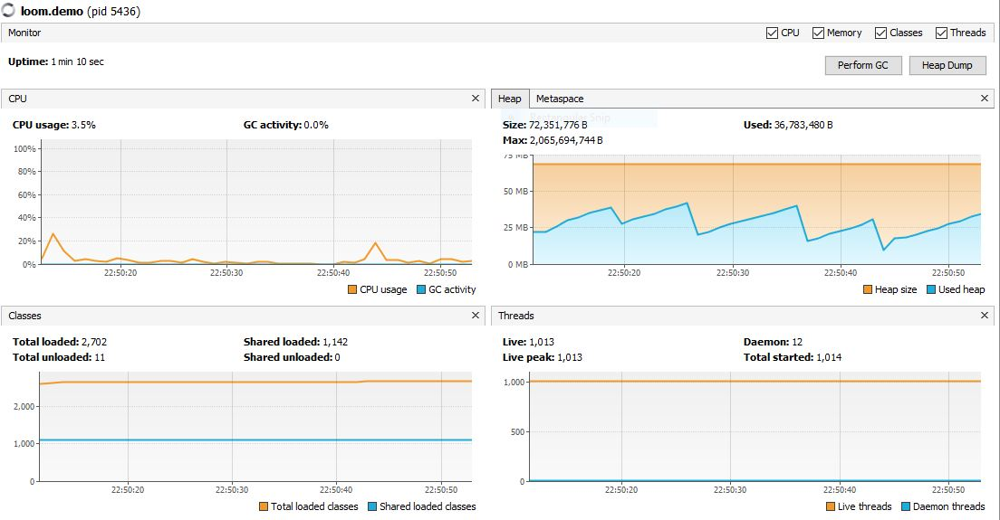
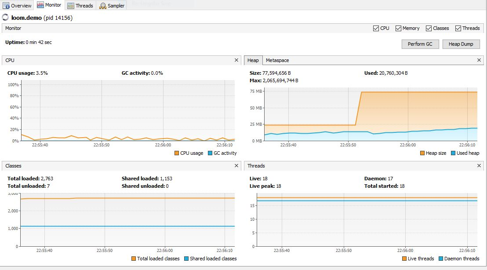

# Project Loom Experiments

Experiments with Project Loom's features 

## Demos

For these demos, you need a current [Project Loom EA build](https://jdk.java.net/loom/) and Maven.
Build the project with `mvn package` to get `target/loom-demo.jar`.
To run it:

```
java --enable-preview -p target/loom-demo.jar -m loom.demo [DEMO] [ARGUMENTS]
```

Where:

* `[DEMO]` selects one of the demo by name--> `ExecutorServices`, `PingServer` or `PingClient`
* `[ARGUMENTS]` configures `NativeThreadPool` or `VirtualThreadExecutor` only for the `ExecutorServices` demo. 

For details on these, see the code.


### Ping Client & Server

A client and server that exchange messages via sockets on localhost:8787. Here I use `Structured concurrency`


To try this out, run the client and the server in different shells.

```
java --enable-preview -p target/loom-demo.jar -m loom.demo PingServer
```

```
java --enable-preview -p target/loom-demo.jar -m loom.demo PingClient Java_Loom
```

### Check how many threads are created and how much memory is used

For these tests a Lenovo T440p will be used:

- 8GB
- Intel(R) Core(TM) i5-4210M CPU @ 2.60GHz
- Windows 10 Pro

```
> java --version
openjdk 19-loom 2022-09-20
OpenJDK Runtime Environment (build 19-loom+1-11)
OpenJDK 64-Bit Server VM (build 19-loom+1-11, mixed mode, sharing)
```


This first implementation of executor service uses a new thread (native) per task.

```
java --enable-preview -p target/loom-demo.jar -m loom.demo ExecutorServices NativeThreadPool 
```



##### Native threads results

- 1013 threads.
- memory usage around 36 Mb.


This second implementation of executor service uses a new thread (virtual) per task. 

```
java --enable-preview -p target/loom-demo.jar -m loom.demo ExecutorServices VirtualThreadExecutor 
```



##### Virtual threads results

- 18 threads.
- memory usage around 20 Mb.
 